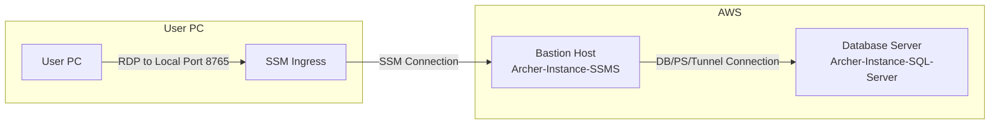

# LocalStack

A repository for code sharing with LocalStack. This repository contains no information proprietary to Archer; it is a project that partially mocks infrastructure for analysis purposes.

## Terraform Deployment: Windows Server with SQL Server

This Terraform script deploys a Windows Server EC2 instance in a new VPC, private subnet, and NAT gateway on AWS. It uses Chocolatey to install SQL Server during instance launch.

### Prerequisites

- Terraform installed locally
- AWS CLI with credentials configured
  - The AWS CLI [Session Manager Plugin](https://docs.aws.amazon.com/systems-manager/latest/userguide/session-manager-working-with-install-plugin.html)

### Usage

#### Deployment

1. Clone the repository:

```bash
git clone https://github.com/ArcherIRM/LocalStack.git
```

2. Navigate to the project directory:

```bash
cd LocalStack
```

3. Update the variables.tf file with your desired values.

4. Configure the AWS CLI to connect to your preferred AWS account for deployment.

5. Run the following commands:

```bash
terraform init
terraform plan # optional
terraform apply
```

Follow the on-screen prompts to confirm the deployment.

6. Note the Terraform output values - some will be needed later.

_Note:_ Due to the various installations taking place on the machines, it will take 10-15 minutes before they are fully baked and ready for action.

#### Connecting to the Database Machine



##### Notes

- The below steps assume these actions are taken from the same directory and with the same AWS CLI configuration as the [Deployment](#deployment) section above.
- The database server deployment does not create a user as a part of the deployment.

##### Steps

1. Retrieve the private key for the EC2 instances from the Terraform state file:

```zsh
jq -r '.outputs.ec2_private_key.value | gsub("\\n"; "\n")' terraform.tfstate \
    > archer-ec2-key.pem
```

2. Retrieve the EC2 password for the SQL Server Management Studio (SSMS) machine/bastion host:

```zsh
aws ec2 get-password-data \
    --instance-id \
        $(aws ec2 describe-instances \
            --filters \
                "Name=tag:Name,Values=Archer-Windows-Instance-SSMS" \
                "Name=instance-state-name,Values=running" \
            --query "Reservations[*].Instances[*].[InstanceId]" \
            --no-cli-pager \
            --output text) \
    --priv-launch-key archer-ec2-key.pem \
    --query 'PasswordData' \
    --no-cli-pager \
    --output text
```

3. Establish a Systems Manager tunnel from your machine to the SSMS machine:

```zsh
aws ssm start-session \
    --target \
        $(aws ec2 describe-instances \
            --filters \
                "Name=tag:Name,Values=Archer-Windows-Instance-SSMS" \
                "Name=instance-state-name,Values=running" \
            --query "Reservations[*].Instances[*].[InstanceId]" \
            --no-cli-pager \
            --output text) \
    --document-name AWS-StartPortForwardingSession \
    --parameters "localPortNumber=8765,portNumber=3389" \
    --region us-west-2
```

4. The tunnel from Step 3 routes the local port 8765 on your machine to port 3389 of the SSMS EC2 instance. With the tunnel established, start an RDP session with `localhost:8765`, and connect as the `Administrator` user with the password retrieved in Step 2. If prompted, select `Yes` for network discoverability.

5. From the Archer-Windows-Instance-SSMS machine:
    - If a user has been created, start SQL Server Management Studio from the remote desktop and connect to the database server's IP address using valid credentials
    - If no SQL Server user has been created, the following PowerShell command can be run from/through the bastion to verify network connectivity between the bastion host (Archer-Windows-Instance-SSMS) and the Database Server (Archer-Windows-Instance-SQL-Server)

```pwsh
$db_ip = # Add the private IP address for Archer-Windows-Instance-SQL-Server here

$result = Test-NetConnection -ComputerName $db_ip -Port 1433

$result.TcpTestSucceeded # Returns True or False
```
